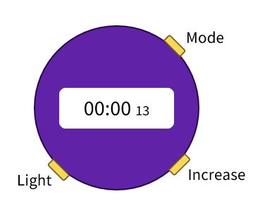
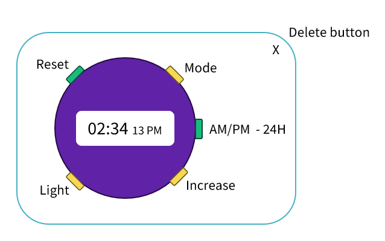

# Instructions

## Part A - Create a watch

### Tasks

- Read the sections `Functional Requirements`, `Technical Requirements` and `UI Design`.
- Create a UML **Class diagram** representing your architectural design.
- Implement the functional requirements in a forked project, on your `main/master` branch.

### Functional Requirements

#### Displaying the time

- Your watch must display the current local time in this format: `hh:mm:ss`.
- It must show the current time and increment **every second**.
- It must have a **trailing zero** if the hour, minute, second is a single digit number (e.g. `1:5:9` should display `01:05:09` instead).

#### Editing the time 
- Your watch has a `mode` button that behaves as follows:
    - When pressing it one time: the hours will visually blink every second, and it is now editable.
    - When pressing it two times: the hours will stop blinking and are not editable anymore, it is now the minutes that are blinking and are now editable.
    - When pressing it three times: everything stop blinking, and nothing is editable anymore.
    - While any part of the time is editable, the time still advances and the UI is still updating.
- Your watch has an `increase` button that behaves as follows:
    - If the hours are editable, it will increase by one when pressing this button. When reaching `23`, the next increase will put it to `00`.
    - If the minutes are editable, it will increase by one when pressing this button. When reaching `59`, the next increase will put it to `00` and the hours will be increased by one.

#### Editing the UI 
- Your watch has a `light` button that behaves as follows:
    - When pressing it, it will toggle a change of color in the watch: the background behind the displayed time will switch from yellow (`#FBE106`) to white (`#FFFFFF`), and vice versa.

### Technical Requirements

- Typescript vanilla, no architectural framework (Angular, Vue, React) is allowed.
- Your architectural design must be in MVC (Model, View, Controller). Class names should include `Model`, `View`, `Controller` when relevant (i.e. `CarModel`, `CarView`, etc.).

### UI Design

Note: this is here to give you an idea, you are free to do your own design.

## Part B - Extend your watch

### Tasks

- Read the sections `Functional Requirements` and `UI Design`.
- **Update** your existing UML **Class diagram** to represent your new architectural design.
- Implement the functional requirements in the same branch as `Part A`.

### Functional Requirements

#### Adding new clocks
- We now want to display multiple clocks. Add a button `Add` that allow to display an additional clock.
- By default, the new clock displays the local time.
- Add a way (to your liking) to select a timezone (i.e. GMT+1, GMT+2, etc.) that will be applied to the newly created clock instead of using the local timezone.
- All the clocks must have their `seconds` synchronized.

#### Editing a clock
- Add a button to switch the time display of a given clock between AM/PM and 24H format.
- Add a reset button to reset the displayed time. This only resets the time value, but not the format, light, editing mode. This keeps the given timezone.

#### Managing clocks
- Add a button for each clock to remove them completely from the page.
- (Extra) Make every clock draggable and being able to switch position between themselves.

### UI Design

Note: this is here to give you an idea, you are free to do your own design.

## Part C - Further extend your watch

### Tasks

- Read the sections `Functional Requirements` and `UI Design`.
- **Update** your existing UML **Class diagram** to represent your new architectural design.
- Implement the functional requirements in the same branch as `Part B`.

### Functional Requirements

#### Add matrices transformation

- Add some utility functions to define a 3x3 matrix, and to be able to apply a transformation to a point, that you will also define.
- To give you some example, you should be able to compute the inverse matrix of a given matrix, to multiply it by another one.
- To transform a point means you can apply a translation, rotation, scale operations.

#### Add a new type of clock

- Add a way (to your liking) to select two different UI of your clock, the first one being the one implemented in part A and B, the second one being an analog clock.
- This analog clock must use the implemented classes (if relevant) in the previous section to animate the clock handles. You must display a handle for hours, minutes, seconds. You cannot use the `transform(deg)` CSS API, but you can use it with a matrix as argument.
- There is no button to modify the analog clock at all.
- Same as in part B, if you added the possibility to remove a clock, any analog clock should be removable too.
- (Extra) Add a button to edit the time like a real analog clock: when in edit mode, you can move the minute handle to update the time, and the time stops during the manipulation.

### UI Design

Note: this is here to give you an idea, you are free to do your own design.

